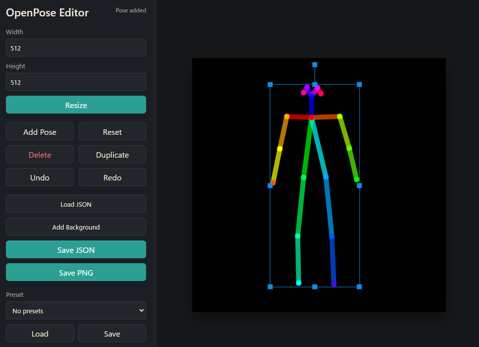

# OpenPose Editor Standalone

日本語 | [English](README.en.md)



軽量な OpenPose / ControlNet JSON 互換ポーズエディタです。

AUTOMATIC1111、Gradio、Electron に依存せず、
ブラウザだけで動作します。

Stable Diffusion / ControlNet 用のポーズ編集を、
シンプルかつ軽量に行うことを目的としています。

---

## 特徴

- ポーズの追加、移動、回転、拡大縮小
- OpenPose / ControlNet JSON の読み込み・保存
- PNG保存
- 背景画像の追加
- Undo / Redo
- ポーズ複製、削除
- JSON / 画像ファイルのドラッグ＆ドロップ
- ブラウザ内プリセット保存
- 軽量スタンドアロン動作
- Python標準ライブラリのみで起動可能

---

## 起動方法（Windows）

Python 3 が必要です。

`start.bat`

をダブルクリックしてください。

ブラウザが自動で開かない場合は、
以下をブラウザで開いてください。

```text
http://127.0.0.1:7865/
```

---

## 手動起動

```bash
python standalone_server.py
```

---

## 対応フォーマット

- OpenPose JSON
- ControlNet OpenPose JSON
- PNG export

---

## このプロジェクトに含まれないもの

このプロジェクトには以下は含まれていません。

- CMU OpenPose 本体
- OpenPose バイナリ
- Caffe
- AI pose detection モデル
- AUTOMATIC1111
- ControlNet backend
- pose detection（画像から自動骨格抽出）

つまり、このプロジェクトは:

```text
画像 → AI骨格検出
```

を行うものではなく、

```text
ポーズ編集
JSON編集
```

を行う軽量エディタです。

---

## なぜ作ったのか

既存の openpose-editor は:

- AUTOMATIC1111依存
- 古いGradio環境依存
- 拡張タブに表示されない
- 起動が不安定
- 環境構築が複雑

などの問題が発生するケースがありました。

このプロジェクトは:

```text
軽量
単独動作
シンプル
```

を目的として再構成しています。

---

## ライセンス

このプロジェクトは MIT License ベースです。

ただし、リポジトリ内の一部コードには
ControlNet 由来コード（Apache-2.0）が含まれる場合があります。

詳細は以下を参照してください。

- LICENSE
- THIRD_PARTY_NOTICES.md

---

## 元プロジェクト

Original project:

- fkunn1326/openpose-editor

ControlNet ecosystem compatibility inspired by:

- lllyasviel/ControlNet

---

## ロードマップ

今後予定している機能:

- 画像からの基本ポーズ自動生成
- MediaPipe Pose 対応
- 指キーポイント対応
- hand pose 編集
- OpenPose JSON 互換性向上

---

## 注意

この standalone 版は、
AUTOMATIC1111 拡張の代替軽量エディタとして設計されています。

そのため:

- AI推論
- pose detection
- ControlNetへの直接送信

などは含まれていません。

---

## Thanks

OpenPose / ControlNet / Stable Diffusion ecosystem developers.